<architecture_analysis>
1.  **Komponenty i Strony do Utworzenia/Aktualizacji:**
    *   **Strony Astro (Nowe):**
        *   `src/pages/auth/login.astro`: Strona logowania.
        *   `src/pages/auth/register.astro`: Strona rejestracji.
        *   `src/pages/auth/forgot-password.astro`: Strona do odzyskiwania hasła.
        *   `src/pages/auth/reset-password.astro`: Strona do ustawiania nowego hasła.
        *   `src/pages/admin/users.astro`: Strona panelu admina do zarządzania użytkownikami.
    *   **Komponenty React (Nowe):**
        *   `src/components/features/auth/LoginForm.tsx`: Formularz logowania.
        *   `src/components/features/auth/RegisterForm.tsx`: Formularz rejestracji.
        *   `src/components/features/auth/ForgotPasswordForm.tsx`: Formularz do odzyskiwania hasła.
        *   `src/components/features/auth/ResetPasswordForm.tsx`: Formularz do resetowania hasła.
        *   `src/components/features/admin/UsersTable.tsx`: Tabela z listą użytkowników.
        *   `src/components/features/admin/UserForm.tsx`: Formularz do edycji/tworzenia użytkownika.
    *   **Layouty i Komponenty Współdzielone (Do Aktualizacji/Utworzenia):**
        *   `src/layouts/Layout.astro`: Główny layout aplikacji, do aktualizacji o logikę warunkową.
        *   `src/components/shared/Header.astro`: (Nowy) Nagłówek, który będzie dynamicznie renderował menu w zależności od stanu autentykacji.

2.  **Główne Strony i ich Komponenty:**
    *   `login.astro` -> `LoginForm.tsx`
    *   `register.astro` -> `RegisterForm.tsx`
    *   `forgot-password.astro` -> `ForgotPasswordForm.tsx`
    *   `reset-password.astro` -> `ResetPasswordForm.tsx`
    *   `admin/users.astro` -> `UsersTable.tsx`, `UserForm.tsx`
    *   Wszystkie strony będą używać zaktualizowanego `Layout.astro`, który zawierać będzie `Header.astro`.

3.  **Przepływ Danych:**
    *   Użytkownik wchodzi na stronę `.astro`.
    *   Strona Astro renderuje odpowiedni komponent formularza React.
    *   Komponent React komunikuje się bezpośrednio z API Supabase po stronie klienta (np. `supabase.auth.signInWithPassword`).
    *   Informacje o sesji (użytkownik, rola) są przekazywane z `middleware` do stron `.astro` poprzez `Astro.locals`.
    *   Strona `Layout.astro` otrzymuje dane o sesji i przekazuje je do `Header.astro`, który renderuje odpowiednie UI.
    *   Komponenty w panelu admina (`UsersTable.tsx`, `UserForm.tsx`) komunikują się z dedykowanymi endpointami API (`/api/admin/users/*`) w celu zarządzania danymi użytkowników.

4.  **Opis Funkcjonalności:**
    *   **`Layout.astro`**: Główna struktura HTML strony. Zawiera `Header.astro` i renderuje zawartość (`<slot />`). Po aktualizacji będzie odczytywać dane sesji.
    *   **`Header.astro`**: Wyświetla nawigację. Będzie pokazywać linki "Zaloguj" / "Zarejestruj" dla gości oraz "Wyloguj" i e-mail użytkownika dla zalogowanych.
    *   **Strony `auth/*.astro`**: Służą jako "opakowania" dla interaktywnych komponentów React, integrując je z systemem stron Astro.
    *   **Komponenty `auth/*.tsx`**: Implementują logikę formularzy, walidację po stronie klienta i komunikację z Supabase Auth.
    *   **Strona `admin/users.astro`**: Wyświetla interfejs do zarządzania użytkownikami, dostępny tylko dla administratorów.
    *   **Komponenty `admin/*.tsx`**: Implementują UI i logikę do listowania, tworzenia i edycji użytkowników, komunikując się z backendem Astro.

```mermaid
flowchart TD
    classDef page fill:#E1F5FE,stroke:#01579B,stroke-width:2px;
    classDef component fill:#FFFDE7,stroke:#F57F17,stroke-width:2px;
    classDef shared fill:#E8F5E9,stroke:#1B5E20,stroke-width:2px;
    classDef updated fill:#FFEBEE,stroke:#B71C1C,stroke-width:2px,stroke-dasharray: 5 5;

    subgraph "Warstwa Prezentacji (UI)"
        subgraph "Layout Aplikacji"
            L1["Layout.astro"]:::updated
            L2["Header.astro (Nowy)"]:::shared
        end

        subgraph "Strony Publiczne"
            P1["/ (index.astro)"]:::page
            P2["/buildings (buildings.astro)"]:::page
        end

        subgraph "Moduł Autentykacji (Nowe Strony)"
            direction LR
            A1["/auth/login.astro"]:::page
            A2["/auth/register.astro"]:::page
            A3["/auth/forgot-password.astro"]:::page
            A4["/auth/reset-password.astro"]:::page
        end

        subgraph "Panel Administratora (Nowa Strona)"
            ADM1["/admin/users.astro"]:::page
        end

        subgraph "Komponenty Reaktywne (React)"
            subgraph "Komponenty Autentykacji (Nowe)"
                C1["LoginForm.tsx"]:::component
                C2["RegisterForm.tsx"]:::component
                C3["ForgotPasswordForm.tsx"]:::component
                C4["ResetPasswordForm.tsx"]:::component
            end
            
            subgraph "Komponenty Panelu Admina (Nowe)"
                C5["UsersTable.tsx"]:::component
                C6["UserForm.tsx"]:::component
            end
        end
    end
    
    subgraph "Logika Backendowa (Astro)"
        B1["Middleware (index.ts)"]:::updated
        
        subgraph "Endpointy API Autentykacji"
            B2["POST /api/auth/logout"]
            B3["GET /api/auth/callback"]
        end

        subgraph "Endpointy API Panelu Admina"
            B4["GET /api/admin/users"]
            B5["POST /api/admin/users"]
            B6["PUT /api/admin/users/[id]"]
            B7["DELETE /api/admin/users/[id]"]
        end
    end

    subgraph "Usługi Zewnętrzne"
        S1["Supabase Auth"]
    end

    %% Relacje
    P1 --> L1
    P2 --> L1
    A1 --> L1
    A2 --> L1
    A3 --> L1
    A4 --> L1
    ADM1 --> L1

    L1 --"Dane o sesji"--> L2

    A1 --"Renderuje"--> C1
    A2 --"Renderuje"--> C2
    A3 --"Renderuje"--> C3
    A4 --"Renderuje"--> C4
    
    ADM1 --"Renderuje"--> C5
    ADM1 --"Renderuje"--> C6

    C1 --"signInWithPassword()"--> S1
    C2 --"signUp()"--> S1
    C3 --"resetPasswordForEmail()"--> S1
    C4 --"updateUser()"--> S1

    L2 --"POST"--> B2
    S1 --"Callback"--> B3

    C5 --"Pobiera/Filtruje dane"--> B4
    C6 --"Tworzy/Edytuje"--> B5 & B6
    C5 --"Usuwa"--> B7

    B1 --"Przetwarza każde żądanie"--> P1 & P2 & A1 & A2 & A3 & A4 & ADM1
    B1 --"Waliduje sesję/rolę"--> S1
    B4 & B5 & B6 & B7 --"supabase.auth.admin"--> S1

```

</architecture_analysis>

<mermaid_diagram>

</mermaid_diagram>
