# CI/CD Architecture

## Pipeline Overview

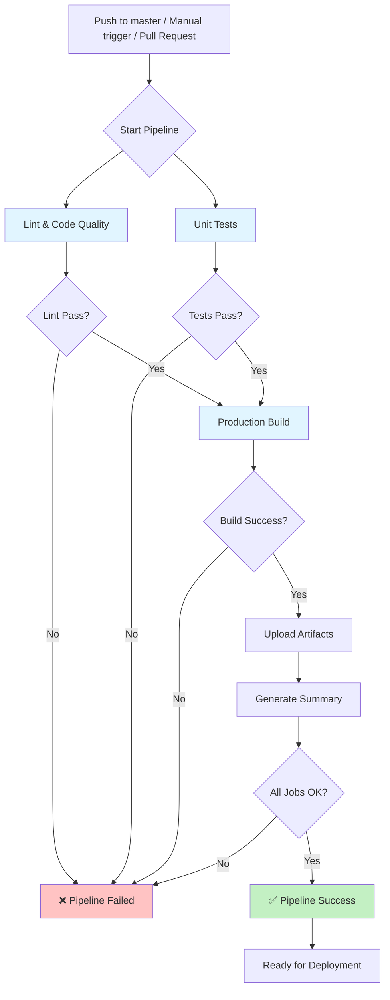

## Job Details

### 1. Lint & Code Quality

**Czas wykonania:** ~1-2 minuty

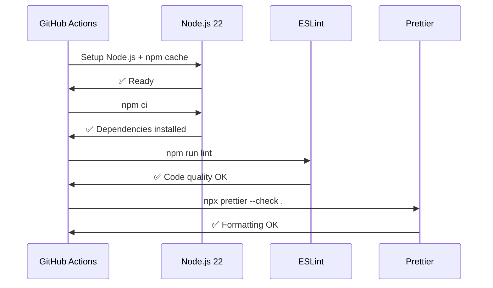

**Co sprawdza:**
- Błędy składniowe TypeScript
- Nieużywane importy i zmienne
- Potencjalne błędy logiczne
- Zgodność z zasadami React
- Formatowanie kodu (Prettier)

### 2. Unit Tests

**Czas wykonania:** ~2-3 minuty

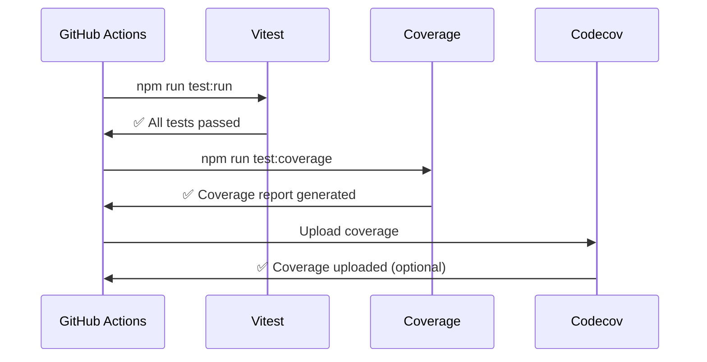

**Co testuje:**
- Komponenty React (React Testing Library)
- Funkcje pomocnicze (utils)
- Serwisy (services)
- Hooki (custom hooks)
- Walidację schematów (Zod)

**Coverage thresholds:**
- Lines: 70%
- Functions: 70%
- Branches: 70%
- Statements: 70%

### 3. Production Build

**Czas wykonania:** ~2-3 minuty

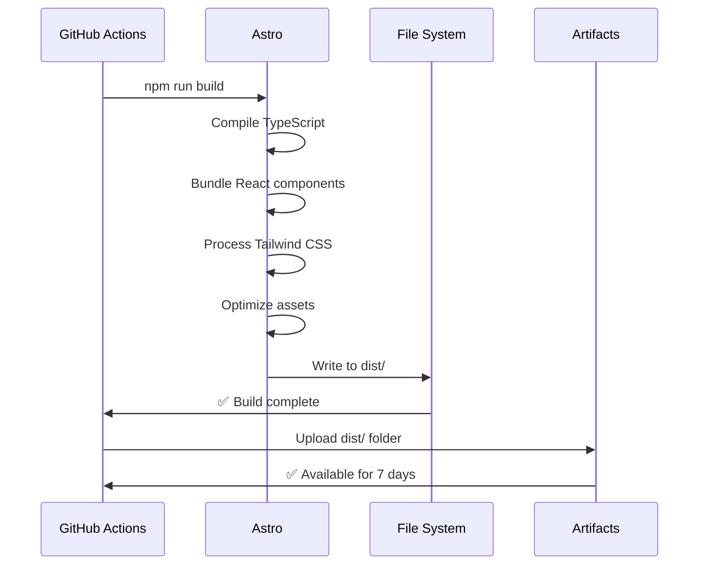

**Co robi:**
- Kompiluje TypeScript do JavaScript
- Bundluje komponenty React
- Przetwarza Tailwind CSS
- Optymalizuje obrazy i assety
- Generuje static HTML (SSG)
- Przygotowuje server-side rendering (SSR)

### 4. Summary

**Czas wykonania:** ~10 sekund

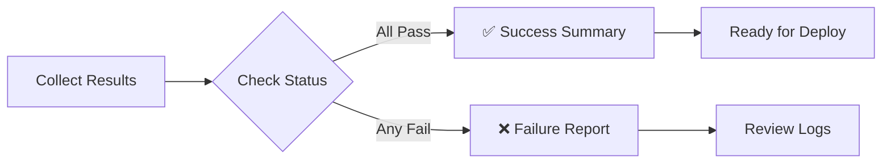

## Workflow Triggers

### Automatic Triggers

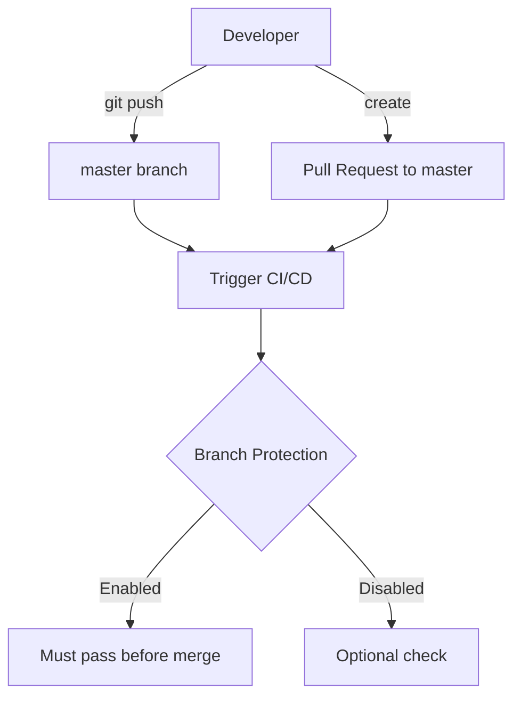

### Manual Trigger

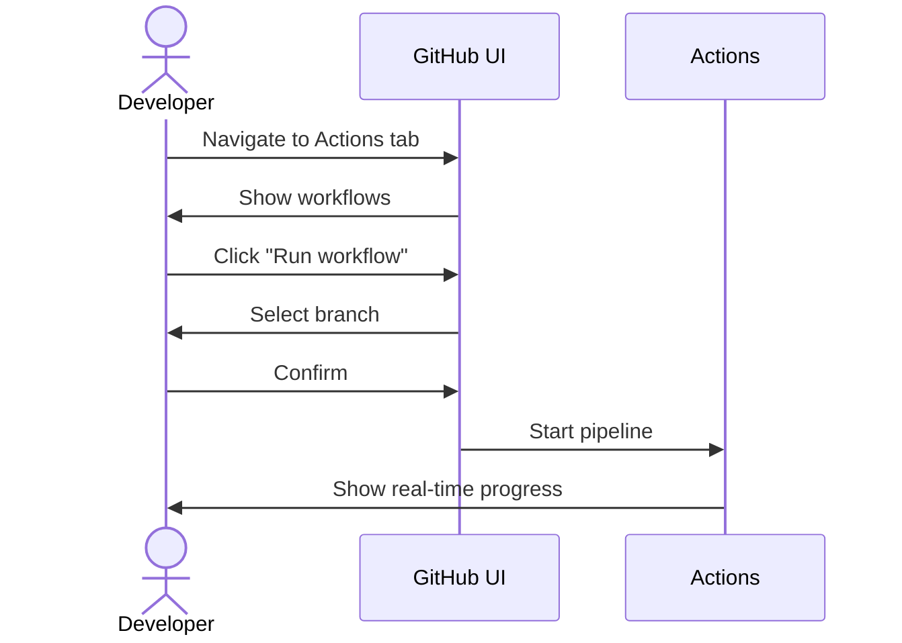

## Artifacts & Reports

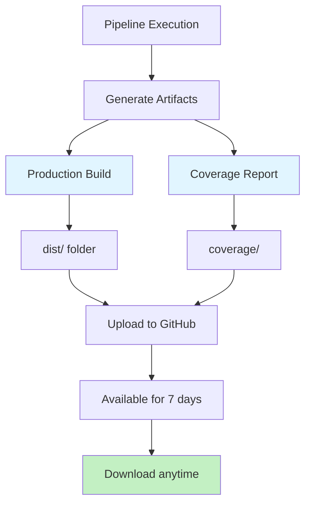

### Dostępne Artifacts

| Artifact | Zawartość | Retencja |
|----------|-----------|----------|
| `production-build` | Folder `dist/` z buildem produkcyjnym | 7 dni |
| `coverage` | Raport pokrycia testów (automatyczny) | N/A |

## Concurrency Control

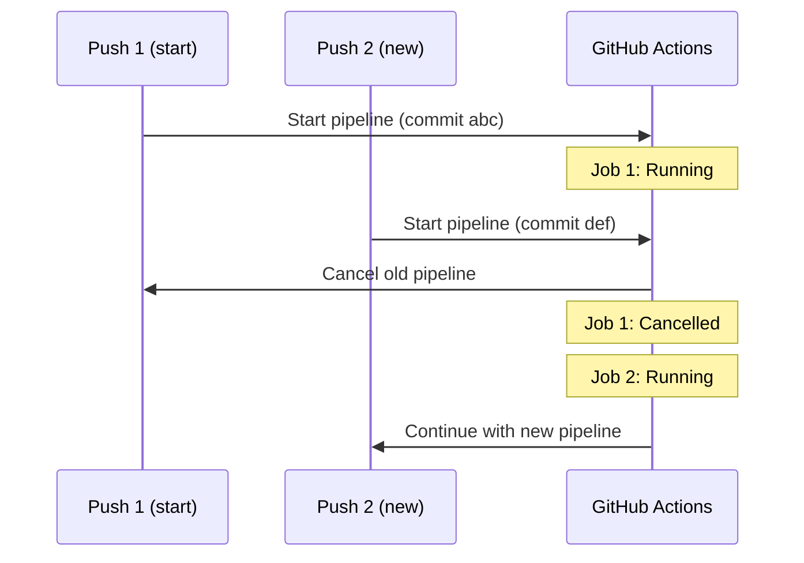

**Korzyści:**
- Oszczędność minut GitHub Actions
- Szybszy feedback dla najnowszych zmian
- Unikanie konfliktów między buildami

## Performance Optimization

### Caching Strategy

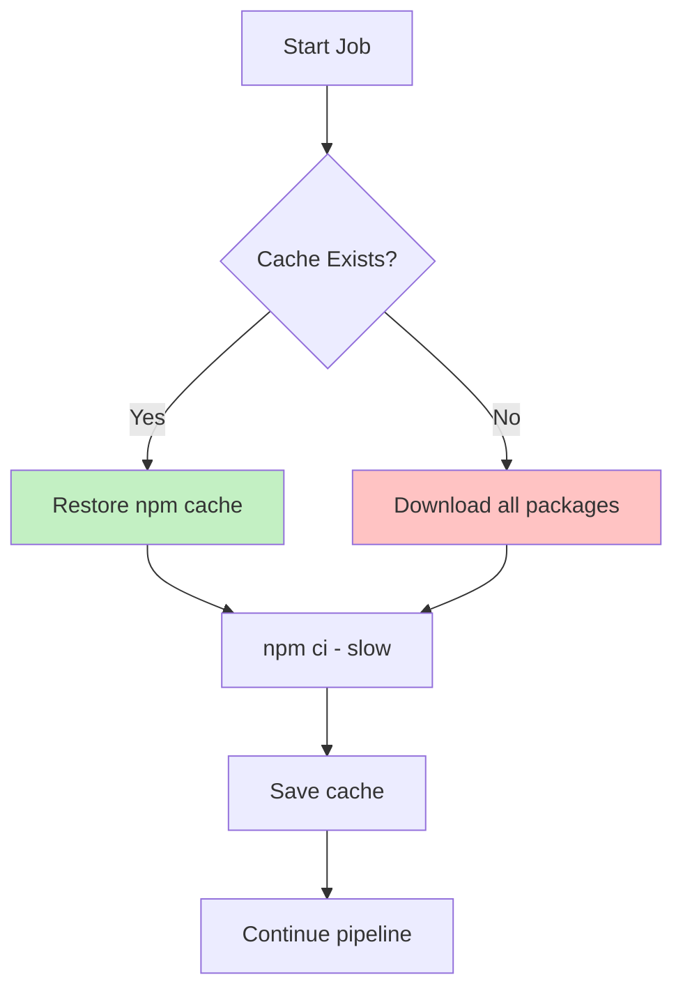

### Parallel Execution

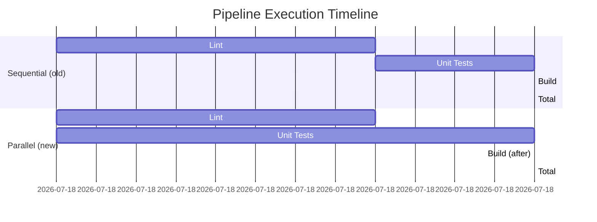

**Oszczędność:** ~25% czasu wykonania

## Security

### Secrets Management

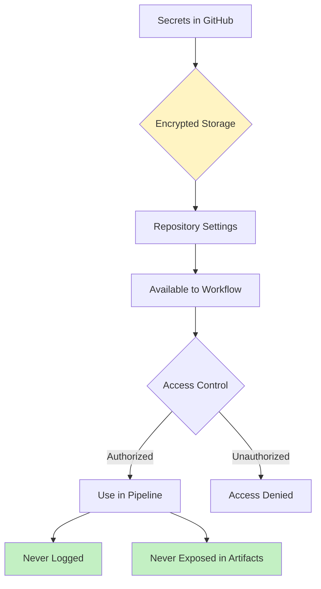

### Secret Protection Rules

1. ✅ Secrets są zaszyfrowane w GitHub
2. ✅ Secrets nie są widoczne w logach
3. ✅ Secrets nie są exportowane do artifacts
4. ✅ Secrets są dostępne tylko dla authorized workflows
5. ✅ Pull Requests z forków nie mają dostępu do secrets

## Future Enhancements

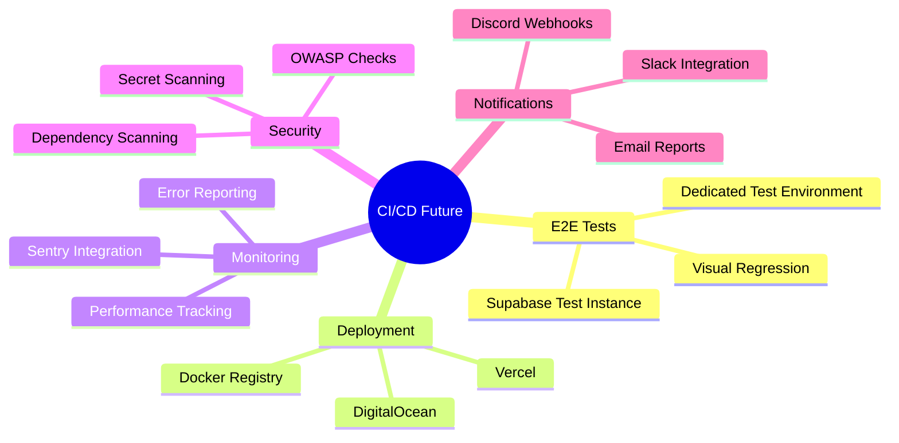

## Monitoring & Metrics

### Key Metrics to Track

| Metric | Target | Current |
|--------|--------|---------|
| Pipeline Duration | < 10 min | ~6 min ✅ |
| Test Coverage | > 70% | Tracked |
| Build Success Rate | > 95% | Monitor |
| Cache Hit Rate | > 80% | Auto |

### Dashboard View (GitHub Actions)

```
┌─────────────────────────────────────────┐
│ CI/CD Pipeline - master                 │
├─────────────────────────────────────────┤
│ ✅ Lint & Code Quality      1m 23s     │
│ ✅ Unit Tests               2m 15s     │
│ ✅ Production Build         2m 48s     │
│ ✅ CI Summary               11s        │
├─────────────────────────────────────────┤
│ Total: 6m 37s                          │
│ Status: Success ✅                      │
└─────────────────────────────────────────┘
```

## Best Practices

### 1. Commit Conventions

```
✅ Good commits trigger successful pipelines:
- feat: add user authentication
- fix: resolve login bug
- test: add unit tests for auth service
- refactor: improve code structure

❌ Avoid:
- WIP commits that break tests
- Commits without running local tests first
```

### 2. Local Testing First

```bash
# Before pushing, always run:
npm run lint           # Check code quality
npm run test:run       # Run unit tests
npm run build          # Verify build works
```

### 3. Branch Protection

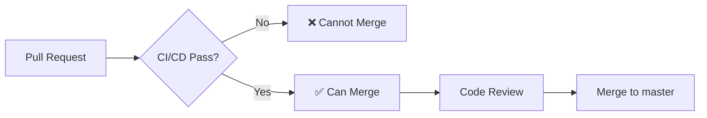

Enable in: `Settings` → `Branches` → `Branch protection rules`

## Troubleshooting Decision Tree

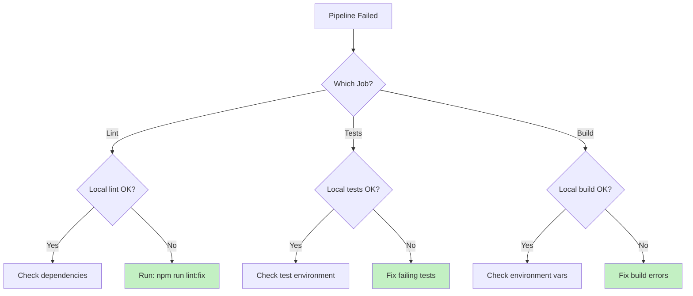

